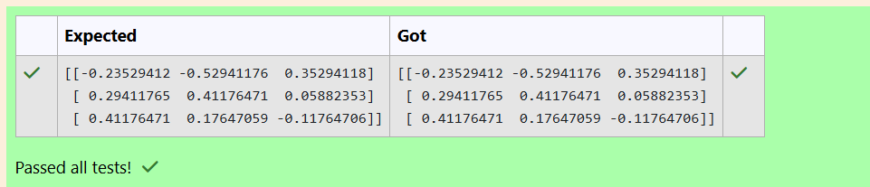

# INVERSE-OF-A-MATRIX
## Aim:
To write a python program to find the inverse of a matrix
## Equipment’s required:
1. 	Hardware – PCs
2. 	Anaconda – Python 3.7 Installation / Moodle-Code Runner
## Algorithm:
### Step1 : Import the numpy module to use the build in function for calculation
### Step 2: Prepare the list from each linear equation assign in np.array()
### Step 3: Using the np.linalg.inv(),we can find the inverse of the given matrix
### Step 4: End the program

## developed by: vijay k
## register number: 24901153
## Program:
    import numpy as np
    A=([[1,0,3],[-1,2,-2],[2,3,-1]])
    rank=np.linalg.inv(A)
    print(rank)
## Output:

## Result:
Thus the inverse of given matrix is successfully solved using python program

